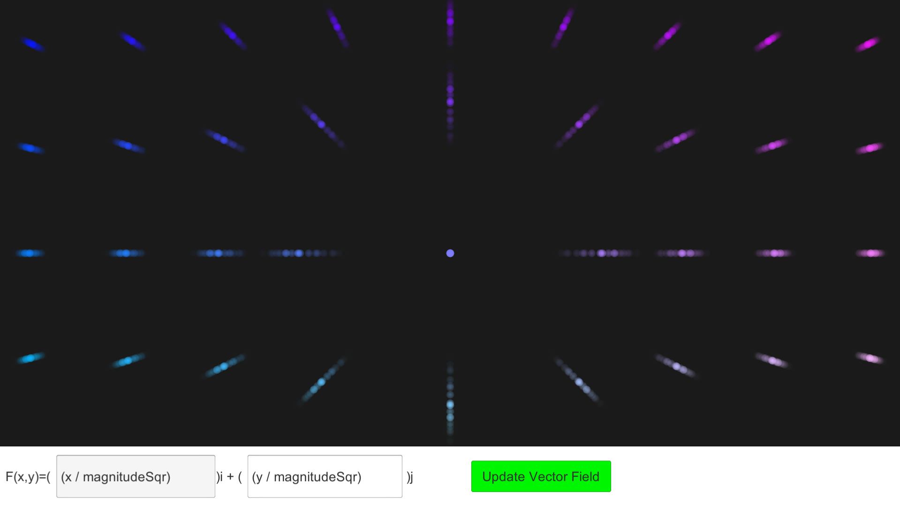
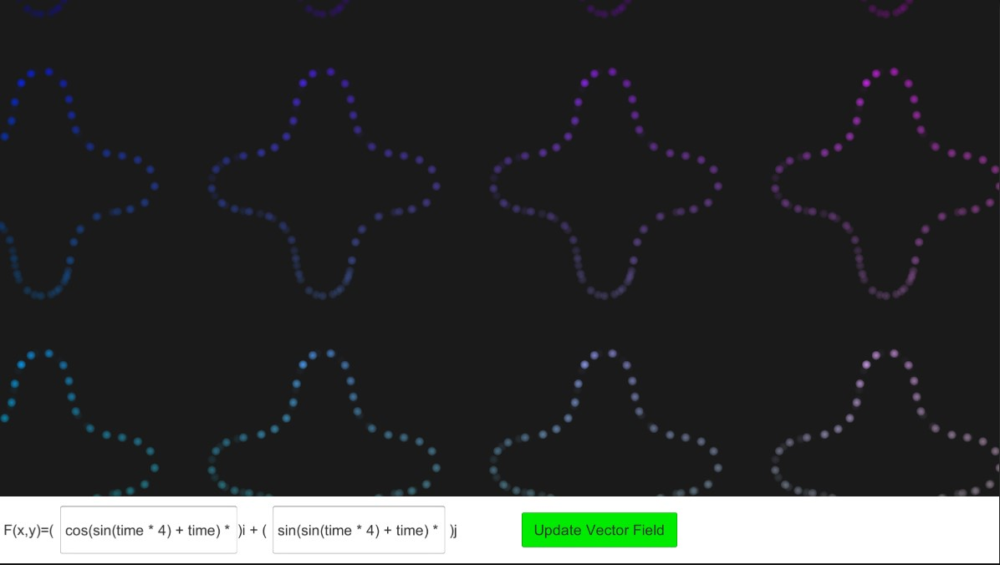
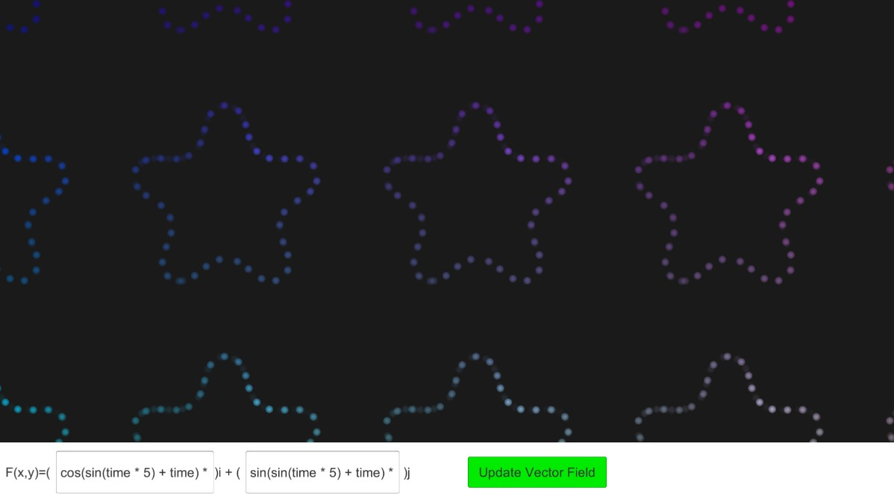
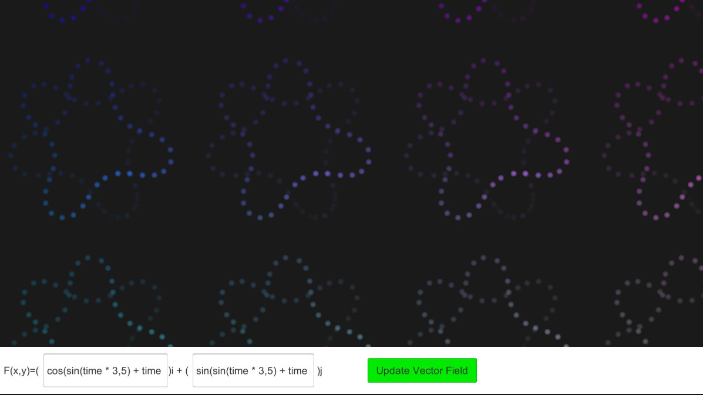

- Spiral field: `(y-x)/5 i + (-x-y)/5 j`
  
***
- An eyes like shape: `sin(y) i + x/3 j`
  
***
- Demonstrating transition from `x/4 i + y/4 j`(outward lines) to `y/4 i + -x/4 j`(nested circles)

***
- Inverse Square Field: `x/(r*r) i + y/(r*r) j`

## Shape Field

This is a field equation that results in polygon like shapes(and moves as a whole with time):
 
`cos(sin(time * a) + time) * scale i + sin(sin(time * a) + time) * scale j` where `a = number of vertices for the shape`
For better visualization, I increased particle lifetime, count and increased space between generator 
- `a=3`

***
- `a=4`

***
- `a=5`

***
- `a=0`

  As one would expect,  `cos(time) i + sin(time) j` creates circles.
   
  ***
When `a` is in the middle of two numbers, it looks like it merges the `a=floor(a)` shape with `a=ceil(a)` shape

- `a=3.5`

It looks like it merges the shapes with `a=3` and `a=4`, at the same time its neither distinctly 3 pointed or 4 pointed.
 
***
- `a=5.5`

***

- `a=0.5`

This creates a leaves/flower like pattern, but is not stable and looks different with increased lifetime

---
These shapes are all I can show with images but watching their shapes clarify, transition from one to another shape is fun and experimenting with the equation always creates some unexpected shape.