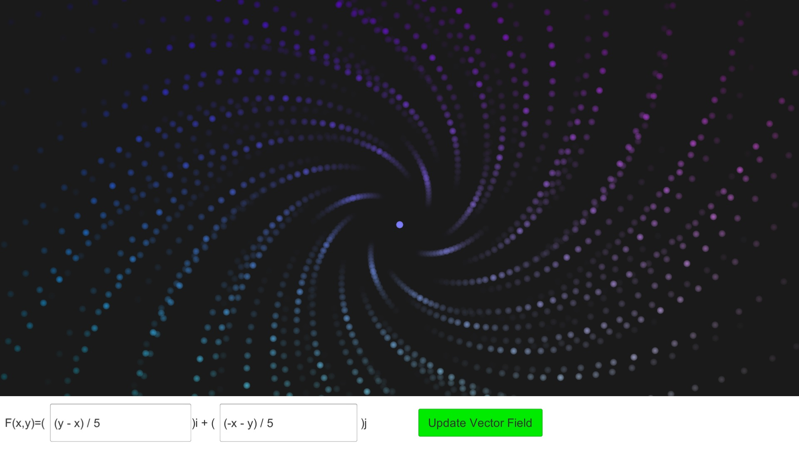
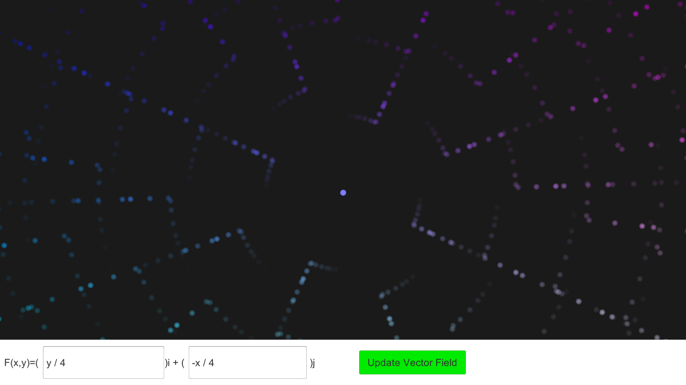

# Vector-Field-Visualizer
A vector field visualizer done with CPU simulated particles moving in the given vector field. 
 
Field equations are dynamic and parsed in runtime, changes in the equations apply to the existing particles, creating cool transitions from an equation to another equation.
## Example Images
- Equation: `(y-x)/5 i + (-x-y)/5 j`
  
  
- Equation: `sin(y) i + x/3 j`
  
  

- Demonstrating transition from `x/4 i + y/4 j`(outward lines) to `y/4 i + -x/4 j`(nested circles)
  

## Parsing
Parsing library is written by me for this project, it is able to parse general math equations, single parameter functions like tan(x), constants like pi, variables coming from the equation fields such as x and y for position.
 
- Variables: 
  - x, y: world position of particles in cartesian coordinates
  - angle, r: world position of particles in cartesian coordinates
  - time: simulation time
  - dx, dy: local position(distance from particles' spawn position/its generator) in cartesian coordinates
- Operations: `+, -, *, /, ^(power), &(log)`
- Single parameter functions: `sin, cos, tan, cot, arctan, arccos, arcsin, exp, ln, sqrt, abs`
- Constants: `pi, e, tau`

## Limitations & Plans
1. The most obvious limitation is speed, since current implementation is single threaded. In the future, I would like to make the whole system in compute shaders or multi threaded on CPU. Making each generator to update their particles in their own thread would require to store the parsed math equation in each generator but it should be easy to implement.
2. Particle generators have the same number of particles, so as an optimization every particle with the same order share the same material since default implementation only changes the alpha.
This limits the particle shaders, such as one cannot scale the particle in with their speed in the shader since shader uniforms are not for only one particle.
3. Math equation provides hard coded fields(x, y etc.) as an optimization since they are used frequently but this makes the implementation of new variables hard.
4. As far as I know, functions with two or more parameters are not easily implementable in the current version since number parser in C# uses only the `,` as the decimal point representation. An obvious solution would be to make functions with a different splitter character.
